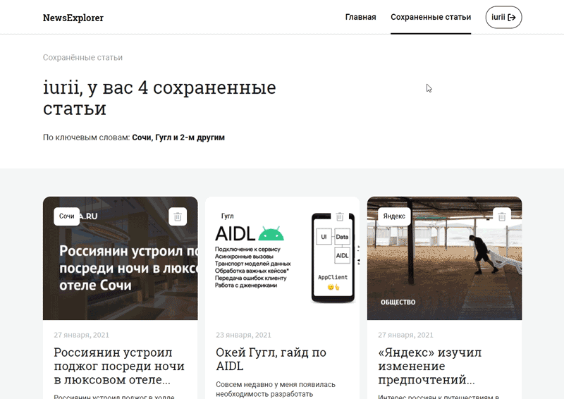

<h1 align="center">
    
</h1>

    
    
    

## Проект NewsExplorer - выпускная работа по профессии веб-разработчик курса [Яндекс Практикум](https://praktikum.yandex.ru 'Яндекс Практикум')

Ссылка на проект: **[NewsExplorer](https://comediant-news.students.nomoredomains.work/)**

Ссылка на проект в gh-pages: **[NewsExplorer GH pages](https://comediant24.github.io/news-explorer-frontend/)**

Ссылка на репозиторий бекенда : **[NewsExplorer API](https://github.com/Comediant24/news-explorer-api)**

## ✍🏻 Краткое описание проекта

Пользователь вводит в строку поиска ключевые слова и нажимает кнопку «Искать». После этого сайт должен выполнить два действия:

- отправить запрос к сервису NewsAPI, найти все подходящие материалы за последнюю неделю и отобразить карточки с ними;
- когда пользователь сохранит понравившиеся новости, они должны отобразиться в специальном разделе на сайте.

Сайт состоит из двух страниц:

- Главная. Содержит только окно поиска.
- Страница с сохранёнными новостями. На ней отображаются материалы, которые пользователь добавил в избранное.

Кроме них на сайте есть всплывающие окна (попапы):

- с формой регистрации (чтобы пользователь мог сохранить новости в личном кабинете);
- с формой входа.

На каждой странице есть одинаковые блоки: они несколько раз используются в разных частях сайта. Повторно используемые компоненты нужно создавать на «Реакте» и использовать БЭМ для описания стилей.
Верстка по макету, файловая структура по БЭМу, верстка должна быть адаптивная. Написать логику открытия и закрытия попапов, обработку событий на JavaScript.

## 📖 Задачи

- Проект адаптирован под различные разрешения экрана, соответствует макетам, сделанным для них.
- Все блоки из макета свёрстаны. Корректно работает навигация между страницами и ссылки на внешние ресурсы: ни одна ссылка не ведёт в пустоту или на якорь, внешние ссылки открываются в новой вкладке.
- Отзывчивая вёрстка, которая корректно тянется на всех промежуточных разрешениях.
- Отсутствуют ошибки валидации.
- В коде используется семантическая разметка: применяются семантические теги, выбор элементов при вёрстке корректен (параграф должен быть параграфом, список — списком); структура DOM-дерева состоит не только из контейнеров div.
- Для позиционирования элементов выбран верный подход, описанный корректным синтаксисом.
- Каркас макета реализован на `Flex layout` и/или `Grid layout`.
- Разметка портирована в JSX.
- Модальные окны настроены и направляют запросы на соответствующие роуты написанного для этого проекта API.
- Правильно работают оба состояния шапки: если пользователь не залогинился, в шапке должна быть кнопка `«Авторизоваться»`; а если пользователь залогинился, кнопка `«Авторизоваться»` исчезает. На её месте появляется ссылка `«Сохранённые статьи»` и кнопка выхода из системы.
- После успешного сабмита формы поиска появляется блок с результатами. Если ничего не найдено, появляется надпись `«Ничего не найдено»`.
- В блоке результата отображаются 3 карточки. Нажатие на кнопку `«Показать ещё»` отображает следующие 3 карточки.
- Если пользователь закрыл вкладку, а после — вернулся на сайт, данные достаются из локального хранилища при монтировании компонента App.
- При клике на иконку `«Сохранить»` в блоке карточки выполняется запрос к` /articles` нашего API.
- На странице «Сохранённые статьи» блоки карточек также содержат: ключевое слово, по которому карточка была найдена, и иконка корзины для удаления статьи.
- Роут `/saved-news` защищён HOC-компонентом `ProtectedRoute`.

## 📹 Демонстрация адаптивности

#

## 📹 Демонстрация работы поиска

#

## 📹 Демонстрация работы личного кабинета

#

## 🧰 Инструменты

- HTML, CSS
- Javascript
- React
- API
- БЭМ

## 🆕 Будущие обновления

- [ ] Переписать код с использованием Redux
- [ ] Переписать код на TypeScript
- [ ] Переписать CSS на Styled Components

## 💻 Установка зависимостей

##### `yarn` – установить зависимости проекта

##### `yarn start` – запуск devServer на http://localhost:3000/

##### `yarn build` – production сборка проекта
